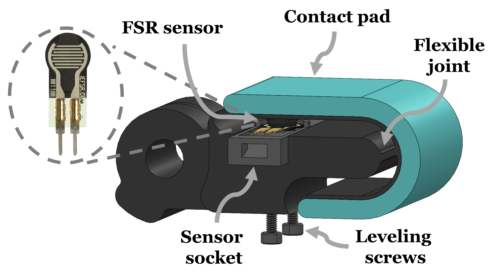

# FlX Finger 

This page provides instructions and design files for manufacturing the FlX finger.

## Background
FlX finger is a low-cost tactile finger. FlX finger is mostly fabricated through 3D printing and is based on the design of the distal finger link of the Model-T42 hand [1]. The FlX finger is composed of four parts seen in the figure above: finger body, contact pad, Force Sensitive Resistor (FSR) sensor and sensor socket. The finger body is connected to the contact pad solely through a flexible joint. In addition, the sensor socket with the FSR are positioned fixed to the finger body. At such configuration, the FSR is in contact with a small bulge on the back side of the contact pad.

## Force Sensitive Resistor (FSR)

FSR sensors are made of polymer films that vary their electrical resistance upon changing pressure on their surface. They are simple to use and low-cost. When an object is being pressed against the contact pad, the flexible joint and pad deform such that different contact locations across the pad provide different voltage. Pressure on the contact pad, therefore, provides voltage signals that embed information regarding the location and magnitude of contact. 

# Manufacture

## Required Materials
### Design files
1. FingerBody.stl
2. SensorSocket.stl

### Electrical

1. Arduino Nano  
2. FSR 400 short by interlink electronics       
3. 4.7k$\Omega$ resistor   
4. Wires
5. USB Cable
6. 2-Pin Female cable

### Chemicals
1.  Smooth-On Mold Star / Silicones, Inc. XP-565  or any related
2.  Ease Release 200 (not mandatory)

##  Procedure
All design files can be found in `cad` repo.
1. **Print parts**: Print `FingerBody.stl` and `SensorSocket.stl` in PLA using 3D printer. 
2. **Mix silicone** : Mix your silicone according to the manufacturer requirements, we used Smooth-On's silicone, which are easy to use without any vacuum degassing requirement. Mix enough Mold Star silicone ( equal amount A:B) to fill the shell of the `FingerBody`
3. **Pour silicone**: slowly pour the silicone into the shell of the `FingerBody`. Let the silicone rest for approximtly 3 hours.
4.  **Wall removal**: Carfully remove the thin-walled molds of the  `FingerBody` using a small utility knife
5. **Glue FSR**: Position& glue the FSR 400 short into the  `SensorSocket`
6. **Attach insert**: Attach M2 heat insert at the bottom of the  `FingerBody` 

7.  **Wire**: Wire the FSR sensor to an analog pin of the Arduino Nano through a voltage divider of 4.7k$\Omega$ resistor.

# Test
We test the characteristic force distribution of the FlX finger, we have designed an experiment using a six degrees-of-freedom robotic arm equipped with a Force/Torque sensor and a rigid pole at its tip. During the experiment, the pole was pushed against the finger with predefined forces between $0-10~N$ and at 50 equal length locations along the contact pad. Results for FlX finger with $V_o= 200 [mV]$ are seen in    `test` repo. 
To acquire somewhat repeatability of measurements, leveling screws on the back side of the finger body are used to vary the height of the sensor socket and, thus, tune the initial voltage on the FSR. By standard, we tune the initial voltage $V_o$ with a weight of 100 grams directly placed on the contact pad when in an horizontal posture.

## Reference

[1] Ma, R., & Dollar, A. (2017). Yale OpenHand Project: Optimizing Open-Source Hand Designs for Ease of Fabrication and Adoption. _IEEE Robotics & Automation Magazine, 24_, 32-40.

