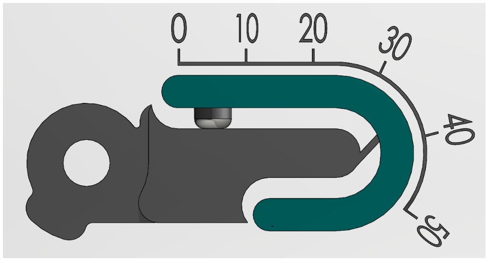
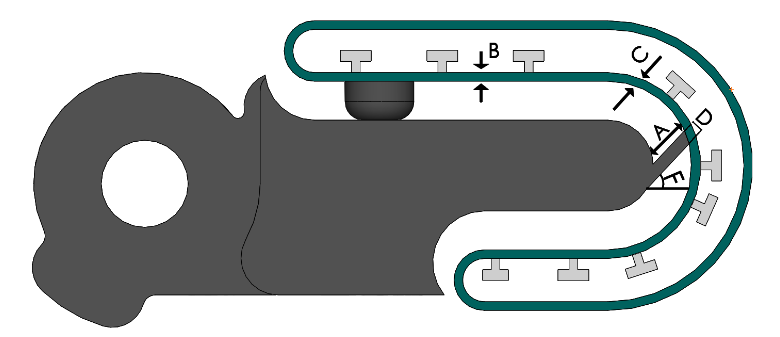
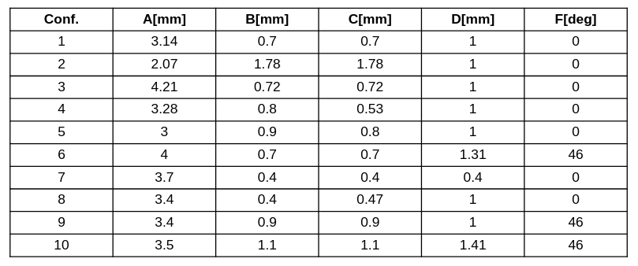

# Signal distribution charachtrization

This repo include the results of experiment to characterize signal distribution on the FlX-finger. In each graph the grey area denotes the main working region during manipulation. When the contact is at the back of the finger, force is reduced on the FSR and the signal becomes negative (relative to the initial load).}

